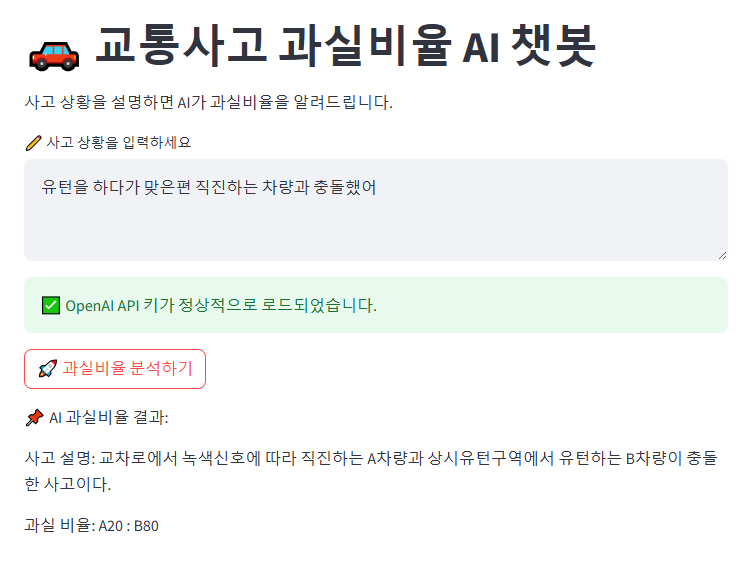

# 교통사고 과실비율을 알려주는 챗봇

## 1. 프로젝트 개요
자동차 교통사고는 하루하루 수없이 많이 발생한다. 이 프로젝트는 자동차 교통사고 발생 시, 사고 당사자들이 보험사에 연락하기 전이나 심야 시간대에도 일반적인 과실비율을 빠르게 알 수 있도록 돕는 AI모델 개발이 목표이다. 사용자들은 사고 후 보험사에서 과실비율을 안내하기 전, 일반적인 과실비율을 미리 알고 있으면 사고 당사자들 간의 합의나 논의에 도움이 될 수 있으며 또한, AI가 사고의 일반적인 판결 기준을 제공함으로써, 보험사 입장에서도 판결을 인정하지 않는 사람들을 설득하는 데도 유용할 수 있다.

## 2. 데이터 크롤링
> 과실비율정보포털: https://accident.knia.or.kr/myaccident1

과실비율정보포털에서는 다양항 교통사고에 대하여 일반적인 과실비율을 보여주고 있다. 이 페이지에서 '사고 상황 설명', '각 차량의 사고 당시 행동', '기본 과실'을 추출하여 json 파일에 저장해놓았다.

## 3. 진행 과정
> https://velog.io/write?id=3b919c51-4246-4870-a070-0f183cb158dd